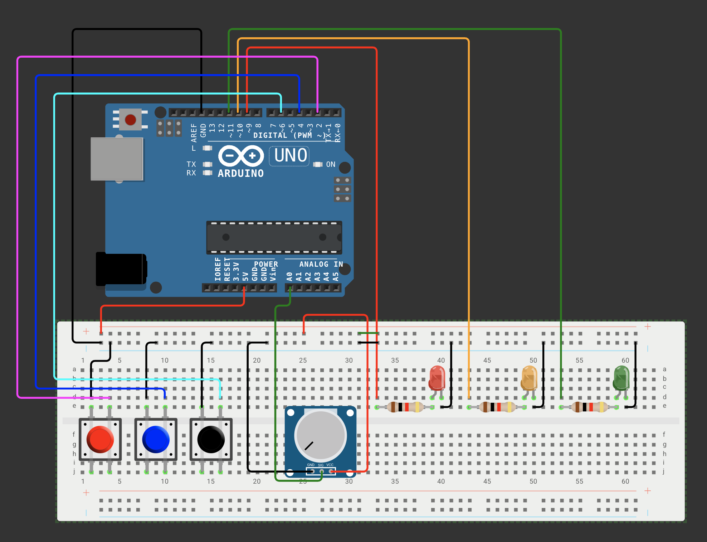

# Arduino + p5.js Traffic Light Controller

이 프로젝트는 **Arduino와 p5.js**를 활용하여 교통 신호 제어 시스템을 구현하는 프로젝트입니다.  
Arduino에서 LED 신호등을 제어하고, 웹 브라우저에서 p5.js를 통해 신호 변경 및 제어 상태를 확인할 수 있습니다.  

## 주요 기능
- 교통 신호 시스템 구현
  - 정상 신호 모드 (RED → YELLOW → GREEN → GREEN BLINK)
  - 비상 모드 (빨간불 ON)
  - 점멸 모드 (모든 LED 깜빡임)
  - 전원 OFF 모드 (모든 LED OFF)
- 가변저항(POT)으로 LED 밝기 조절
- p5.js 웹 UI를 통해 신호등 시간 변경 가능
- WebSerial을 활용한 실시간 Arduino ↔ 웹 통신

## 사용 기술
- **Arduino (PlatformIO)**
- **p5.js (JavaScript)**
- **WebSerial API**
- **HTML / CSS / JavaScript**
- **VS Code + PlatformIO**

---


## 핀 번호 및 기능 설명
| 기능              | 핀 번호 | 설명 |
|------------------|--------|---------------------------------|
| 비상 버튼       | `2`    | 비상 모드 ON/OFF |
| 점멸 버튼       | `4`    | 점멸 모드 ON/OFF |
| 전원 ON/OFF 버튼 | `6`    | 전체 시스템 ON/OFF |
| 빨간 LED        | `9`    | 신호등의 RED |
| 노란 LED        | `10`   | 신호등의 YELLOW |
| 초록 LED        | `11`   | 신호등의 GREEN |
| 가변저항 (POT)  | `A0`   | LED 밝기 조절 |

---
## 프로젝트 구조
```
TRAFFIC_LIGHT
├── arduino/              # Arduino 관련 코드 폴더
│   ├── src/              # Arduino 소스 코드
│   │   ├── main.cpp      # Arduino 코드 (LED 및 버튼 제어)
│   ├── include/          # 프로젝트 헤더 파일 (필요 시 추가)
│   ├── lib/              # 추가 라이브러리 폴더 (필요 시 추가)
│   ├── test/             # 테스트 관련 파일
│   ├── .gitignore        # Git 무시할 파일 설정
│   ├── platformio.ini    # PlatformIO 설정 파일
├── .pio/                 # PlatformIO 빌드 파일 (자동 생성됨)
├── .vscode/              # VS Code 설정 파일
│   ├── c_cpp_properties.json
│   ├── extensions.json
│   ├── launch.json
├── p5/                   # 웹 UI 파일 (p5.js)
│   ├── index.html        # 웹 UI (p5.js + WebSerial 포함)
│   ├── sketch.js         # p5.js 스크립트 (Arduino와 시리얼 통신)
│   ├── style.css         # 웹 UI 스타일 (선택 사항)
├── README.md             # 프로젝트 설명 파일
```
---

## 실행 방법

### 1. VS Code + PlatformIO 설정
1. **VS Code**를 설치합니다.
2. **PlatformIO** 확장을 설치합니다.
3. 이 저장소를 클론하거나 다운로드합니다.
4. VS Code에서 프로젝트를 열고 **PlatformIO를 실행**합니다.
5. **보드 선택 후 업로드** (`platformio.ini`에서 환경 설정 가능)
6. **Arduino 보드와 컴퓨터 연결**

### 2. 웹 UI 실행 (p5.js)
1. `p5` 폴더에서 `index.html`을 실행합니다.
2. 크롬 브라우저에서 `Connect` 버튼을 눌러 **Arduino와 연결**합니다.
3. 버튼을 눌러 신호등을 제어하고, 가변저항을 돌려 LED 밝기를 조절할 수 있습니다.

---

## 기능 상세 설명
### Arduino 동작
- `src/main.cpp`에서 **TaskScheduler**를 사용하여 **50ms 간격**으로 신호를 업데이트합니다.
- 버튼 인터럽트(`attachPCINT`)를 이용해 모드를 변경합니다.
- `Serial.readStringUntil('\n')`을 통해 **p5.js에서 전송한 신호 변경 데이터**를 수신합니다.

### p5.js(Web UI) 동작
- `p5.webserial.js`를 사용하여 **Arduino와 시리얼 통신**합니다.
- 신호등 상태를 시각적으로 표시하고, 버튼을 눌러 제어할 수 있습니다.
- 사용자가 입력한 시간 값(`2000,500,2000` 형식)을 Arduino로 전송하여 신호 변경 속도를 조절할 수 있습니다.

---

## 필요 환경
### 하드웨어
- Arduino Uno (또는 호환 보드)
- LED (빨강, 노랑, 초록)
- 저항 (각 LED에 맞는 저항값 사용)
- 버튼 3개
- 가변저항 (POT)

### 소프트웨어
- VS Code
- PlatformIO
- 웹 브라우저

---

## 참고 자료
- [p5.js 공식 문서](https://p5js.org/)
- [WebSerial API](https://github.com/gohai/p5.webserial)
- [PlatformIO 공식 문서](https://platformio.org/)
- [Arduino 공식 문서](https://www.arduino.cc/reference/en/)

---

## 라이선스
이 프로젝트는 MIT License를 따릅니다.
